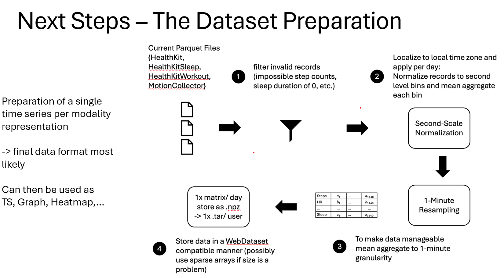

# MHC Dataset

## Setup

Create a virtual environment and install the dependencies (make sure you work with a more recent Python release > 3.7).

```bash
python -m venv venv
source venv/bin/activate
```

Install the dependencies.
```bash
pip install -r requirements.txt
```
Install the package in editable mode to allow for development and testing without import issues.
```bash
pip install -e .
```

Install the SlurmMultiNodePool package to make distributing the code on a cluster simple.
```bash
pip install git+https://github.com/NarayanSchuetz/SlurmMultiNodePool.git
```

## Run

Currently the code is designed to be run on a SLURM cluster (specifically the Stanford Sherlock cluster).
In the file `run_on_sherlock.ipynb` we have an example of how to run the code on a single user_id (one user). As well as how to run it on a cluster. Make sure that the folder structure of the input data is correct. Or adjust the dataloader.

## Pipeline
Without going into too much detail, the pre-processing pipeline mostly follows the logic displayed below:



## Resulting Dataset

The dataset is stored in the specfified output folder e.g. `data/mhc`.

For each user_id a separate directory with the user_id is created. Inside this directory there are multiple `YYYY-MM-DD.npy` files for each day that the user has any HealthKit data.

The numpy file contains a 2 x C x 1440 array where 1440 is the number of minutes in a day and C is the number of data streams. Currently the data streams C (C=24) are:

| Data Stream                                       | Unit   | Date_1 | ... | Date_1440 |
|---------------------------------------------------|--------|--------|-----|-----------|
| HKQuantityTypeIdentifierStepCount                 | count/s  |        | ... |           |
| HKQuantityTypeIdentifierActiveEnergyBurned        | cal/s   |        | ... |           |
| HKQuantityTypeIdentifierDistanceWalkingRunning    | m/s      |        | ... |           |
| HKQuantityTypeIdentifierDistanceCycling           | m/s      |        | ... |           |
| HKQuantityTypeIdentifierAppleStandTime            | min/s    |        | ... |           |
| HKQuantityTypeIdentifierHeartRate                 | count/s    |        | ... |           |
| HKWorkoutActivityTypeWalking                      | binary |        | ... |           |
| HKWorkoutActivityTypeCycling                      | binary |        | ... |           |
| HKWorkoutActivityTypeRunning                      | binary |        | ... |           |
| HKWorkoutActivityTypeOther                        | binary |        | ... |           |
| HKWorkoutActivityTypeMixedMetabolicCardioTraining | binary |        | ... |           |
| HKWorkoutActivityTypeTraditionalStrengthTraining  | binary |        | ... |           |
| HKWorkoutActivityTypeElliptical                   | binary |        | ... |           |
| HKWorkoutActivityTypeHighIntensityIntervalTraining| binary |        | ... |           |
| HKWorkoutActivityTypeFunctionalStrengthTraining   | binary |        | ... |           |
| HKWorkoutActivityTypeYoga                         | binary |        | ... |           |
| HKCategoryValueSleepAnalysisAsleep                | binary |        | ... |           |
| HKCategoryValueSleepAnalysisInBed                 | binary |        | ... |           |
| stationary                                        | binary |        | ... |           |
| walking                                           | binary |        | ... |           |
| running                                           | binary |        | ... |           |
| automotive                                        | binary |        | ... |           |
| cycling                                           | binary |        | ... |           |
| not available                                     | binary |        | ... |           |

The first index (0) of the 3D-tensor's first dimension contains an indicator mask (1=observed data; 0=no observed data) of the same size as the second index (the actual per minute data) matrix.
The second index (1) of the tensor first tensor dimension contains the actual per minute data.

In each created user_id directory there is also a `metadata.parquet` file which contains the following information for each data stream and date:

- `data_coverage`: Percentage of minutes that have valid data (neither 0 nor NaN) for each data stream
- `n`: Number of valid elements (from mask) for each data stream
- `sum`: Sum of valid elements for each data stream
- `sum_of_squares`: Sum of squared valid elements for each data stream
- `date`: The date of the measurements
- `original_time_offset`: The timezone offset of the original data

This metadata is used to track data quality and can be used for global data standardization across multiple days and users.
